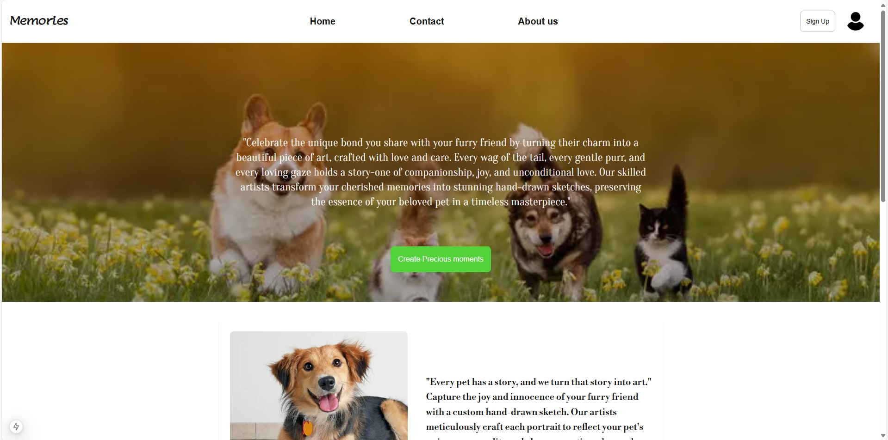
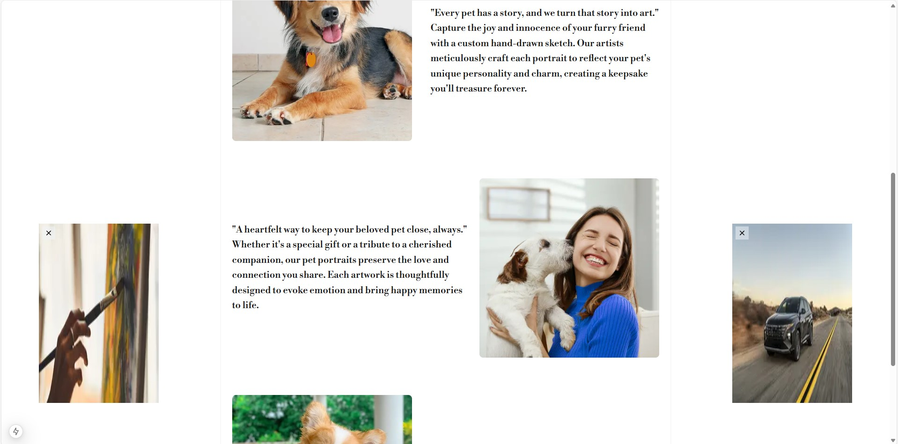
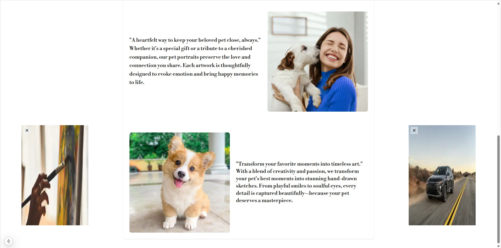
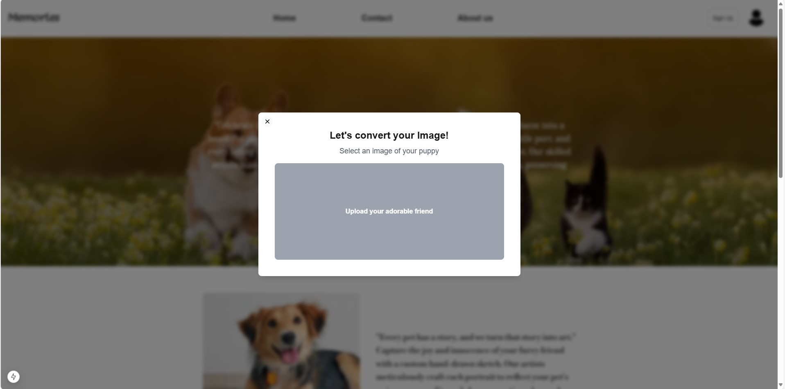
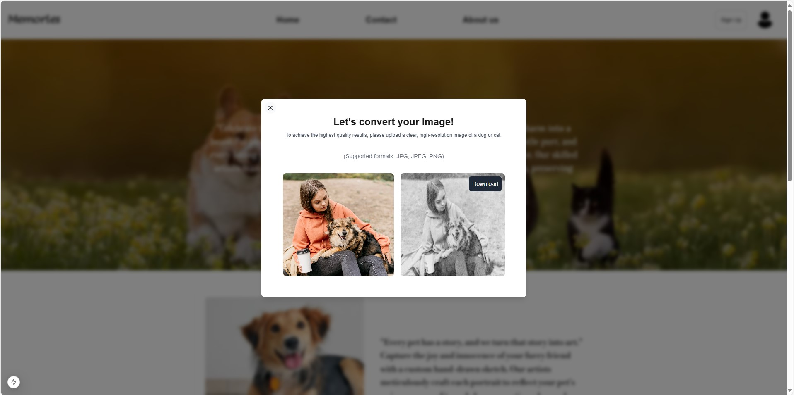

# 🐶 Memories - AI-Powered Pet Sketch Service 🖌️

## 📝 프로젝트 소개
**Memories**는 반려동물의 소중한 순간을 예술적인 스케치로 변환하는 AI 기반 웹 애플리케이션입니다.  
사용자는 반려동물 사진을 업로드하면, AI가 이를 수작업으로 그린 듯한 스케치로 변환해 줍니다.

---

## 🎥 서비스 시연 영상
[▶️ 서비스 시연 영상 보기](https://drive.google.com/file/d/1Ca6Jjq2e-ZWte4s-6mvcklrR55Biix_-/view?usp=drive_link)

---

## 📌 주요 기능
✅ 반려동물 사진을 AI 기반으로 스케치 변환  
✅ 간단한 인터페이스를 통한 이미지 업로드 및 다운로드 지원  
✅ 웹사이트에서 직접 변환된 이미지를 확인 후 저장 가능  
✅ 사용자 경험을 고려한 직관적인 디자인  

---

## 🖼️ 서비스 화면

### 🔹 메인 화면


### 🔹 메인 섹션 - 1


### 🔹 메인 섹션 - 2


### 🔹 서비스 체험 - 이미지 업로드


### 🔹 변환된 이미지 다운로드


---

## ⚙️ 기술 스택

### 💻 Frontend
- **Framework:** Next.js  
- **Language:** TypeScript  
- **Styling:** TailwindCSS  

### 🔧 Backend
- **Framework:** FastAPI (Python)  
- **Storage:** AWS S3  

---

## 📌 프로젝트 실행 방법

### 1️⃣ 클론 및 의존성 설치
```sh
git clone https://github.com/your-repo/memories.git
cd memories
